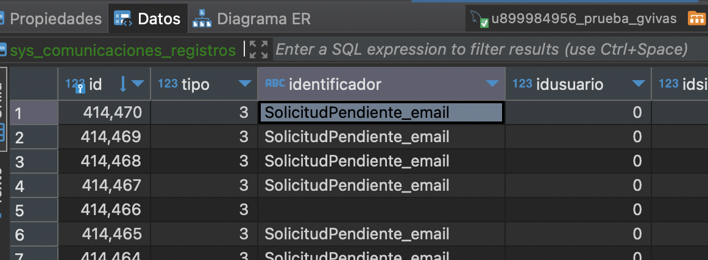

### Requerimiento

```
PHP  7.4
```

### Datos de DB
```
host: 2.59.150.4
Nombre de la base de datos MySQL : u899984956_prueba_gvivas
Nombre de usuario MySQL : u899984956_prueba_gvivas
Contraseña: Prueba@2024
```
### Instalar Compose
```
composer install
```

### Correr la Aplicacion
```
php artisan serve
```
### Ejecutar Job
```
php artisan queue:work
```

### Ruta para correr el job
```
http://127.0.0.1:8000/simulation
```


### Asi queda luego de ejecutar

  